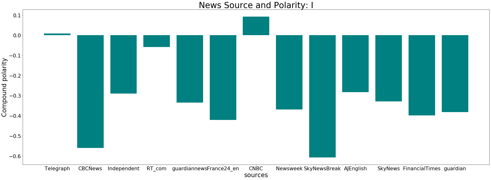
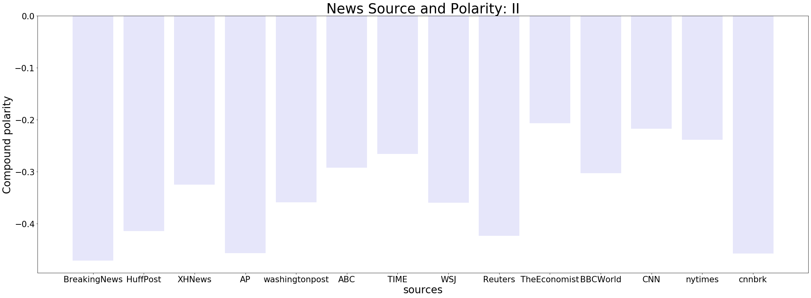
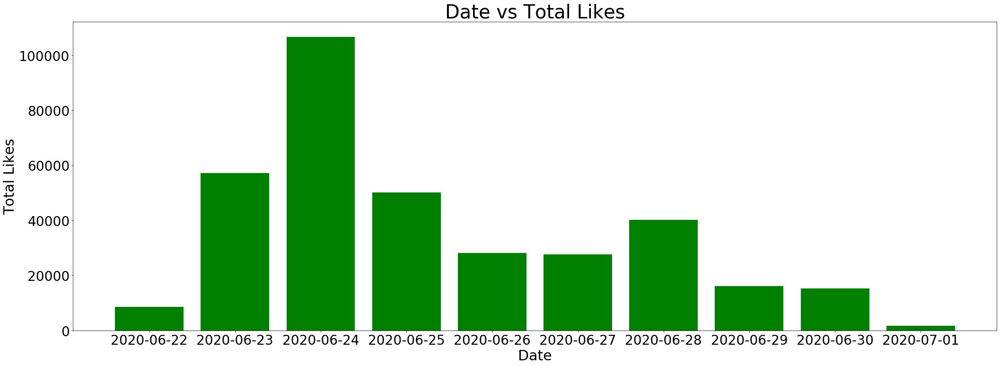
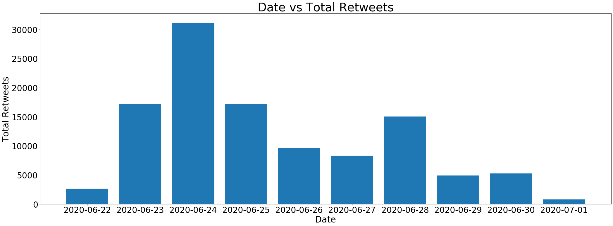

# Twitter News Sentiment Analysis (BLACK LIVES MATTER)
This project is meant to identify and quantify the bias in media representation if there is any. I collected the tweets from the thirty most followed news media bodies on twitter containing a list of words surrounding a political issue for analysis. The code is reusable but this analysis has been done on the Black lives matter movement.
## Data Streaming and Collection:
+ The twitter API tweepy allows us to stream the data as well as filter it but the restriction is that it can only be upto 7 days older, this study was done on tweets from 21st June 2020 till 30th June 2020, yet the code is compatible with more than the standard twitter developer account. 
+ The data collected here is that of the tweets from the top thirty news media twitter platforms, the list of these channels has been attached to another markdown. 
+ The Twitter API access is permitted through a twitter developer account after which we get a API access credentials which I saved in a different notebook and accessed it using the Pickle python serialization.
+ The tweets, usernames, likes, retweet count, and the date of creation was stored
+ I stored all the tweets by these news handles in the last seven days containing the words, ["Black+lives+matter","racism", "police+brutality", "george+floyd","breonna+taylor","ahmaud+arbery", "police+protest","defund+police","minnesota+police"]
+ This was done in three sessions so as to avoid running out of API calls in the standard (free) twitter developer account. 
+ About 1028 tweets were stored as well as the number of retweets for each of the tweets using the pickle library to easily move data between notebooks.

## Data Analysis
+ I wrote a tweet cleaning function to remove any emojis, links, or @addresses from the analysis
+ An entities column was created for each of the tweets for reflection
+ Using the NLTK library's sentiment analyzer, the polarity of each tweet was calculated and stored
+ The average of the compound polarity was stored for each news source in a separate dataframe for later represenation
+ A total likes and retweets for all the tweets for the movement by the media by dates were put in a different dataframe for representation

## Visualizations 
### Sentiment Polarity for all News sources used

### Time vs Likes

### Time vs Retweets

## Conclusion
+ Since the sentiment is as high as 0.5 to even 0.6 negatively for some of the media sources, the media could be at fault for framing bias
+ With something like the Black Lives Matter movement, should the media remain unbiased at all?
+ These are the sentiments simply of the tweet headlines, not of media articles. So this is a huge restriction, yet some news sources like the Telegraph and CNBC managed to have low polarity.
+ On 24th June 2020, there was a surge of news on this matter. This could correlate with other news of the day, like the suspension of H1-B visas till the end of the year 2020.
